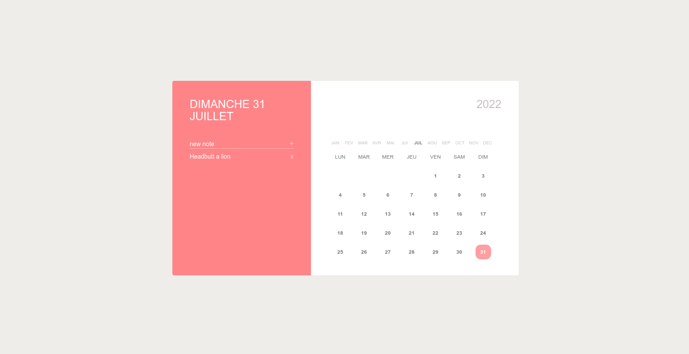

This our first project to practice date in js

# Project overview



# The goal for thist project
## Use your kwnowlege about date then make this calendar dynamic

# How to contribute

- fork this repository
- make your change in your personal repository
- push your own local repository
- send your repo link to your coach

# How to install this project

The first thing you have to do after forked this project is to clone your perso repo

```bash
 git clone https://github.com/<your_username>/<the_forked_reponame>.git

```

Then, you should navigate to your cloned project like that

```bash
cd <the_forked_reponame>/
```

After that you must install the dependencies like that

```bash
npm install
```


And finally lunch the server

```bash
npm start
```

Click le output url in you console to see the result or open your browser type the url below.

```text
http://localhost:3000
```

